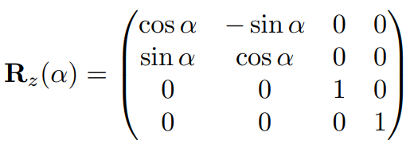
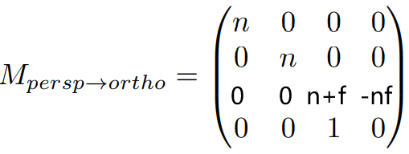
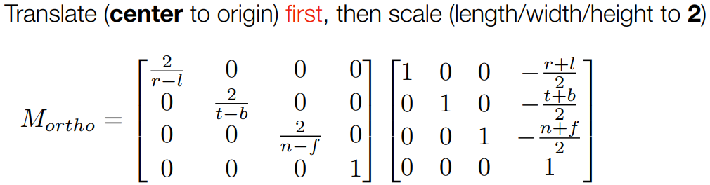
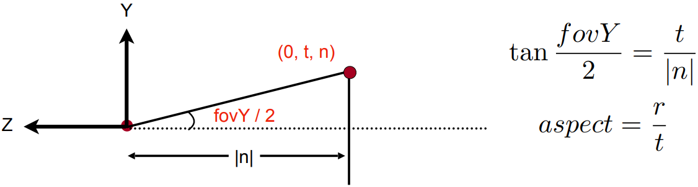
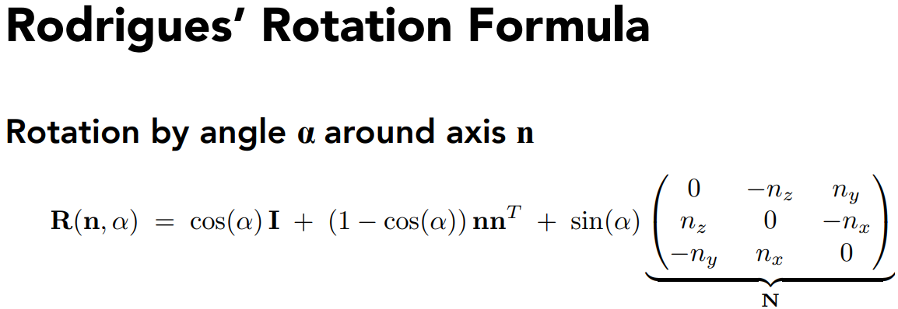

# GAMES101-作业1

只需实现mvp变换中的model和projection，view和其他光栅化已经实现好了。可参考view的代码来写model和projection的矩阵。

难度：easy

任务：

## 1. 实现get_model_matrix函数，其返回一个能绕z轴旋转的变换矩阵

根据PPT Lecture_04的Page 8可知：



参考get_view_matrix函数的代码，很容易得到如下代码：

```cpp
Eigen::Matrix4f get_model_matrix(float rotation_angle)
{
	Eigen::Matrix4f model = Eigen::Matrix4f::Identity();

	// TODO: Implement this function
	// Create the model matrix for rotating the triangle around the Z axis.
	// Then return it.

	Eigen::Matrix4f rotation;
	float radian = rotation_angle / 180.f * MY_PI;
	rotation << cosf(radian), -sinf(radian), 0, 0,
		sinf(radian), cosf(radian), 0, 0,
		0, 0, 1, 0,
		0, 0, 0, 1;

	model = rotation * model;

	return model;
}
```


## 2.实现get_projection_matrix函数，其返回一个进行投影变换的矩阵（perspective+orthographic projection）

该函数需要完成投影变换，即先进行透视投影，再进行正交投影。

由Lecture 4的Page 33~36可得到perspective projection的矩阵为：



由Lecture 4的Page 24可知orthographic projection的矩阵为：



由于函数的参数没有直接给left, right, buttom, top，而给的是fov角度和宽高比，而根据Lecture 5的Page 6可得到fov、aspect与l, r, b, t的转换如下：



最终可得到如下代码：

```cpp
Eigen::Matrix4f get_projection_matrix(float eye_fov, float aspect_ratio,
									  float zNear, float zFar)
{
	Eigen::Matrix4f projection = Eigen::Matrix4f::Identity();

	// TODO: Implement this function
	// Create the projection matrix for the given parameters.
	// Then return it.

	Eigen::Matrix4f perspective;
	perspective << zNear, 0, 0, 0,
		0, zNear, 0, 0,
		0, 0, zNear + zFar, -zNear * zFar,
		0, 0, 1, 0;

	float fov_radian = eye_fov / 180.f * MY_PI;
	float left, right, top, buttom;
	top = fabs(zNear) * tanf(fov_radian / 2);
	buttom = -top;
	right = top * aspect_ratio;
	left = -right;

	Eigen::Matrix4f ortho_translate, ortho_scale;
	ortho_translate << 1, 0, 0, -(right + left) / 2,
		0, 1, 0, -(top + buttom) / 2,
		0, 0, 1, -(zNear + zFar) / 2,
		0, 0, 0, 1;
	ortho_scale << 2 / (right - left), 0, 0, 0,
		0, 2 / (top - buttom), 0, 0,
		0, 0, 2 / (zNear - zFar), 0,
		0, 0, 0, 1;
	Eigen::Matrix4f orthographic = ortho_scale * ortho_translate;

	projection = orthographic * perspective;

	return projection;
}
```


## 3. 提高项：在 main.cpp 中构造一个函数，该函数的作用是得到绕任意 过原点的轴的旋转变换矩阵。 Eigen::Matrix4f get_rotation(Vector3f axis, float angle)

根据Lecture 4的Page 10的**罗德里格斯旋转公式**来实现变换矩阵：



需要注意该公式得到的R(n, α)为3x3矩阵，我们需要的是4x4的齐次坐标矩阵，而旋转变换矩阵的左上角3x3为旋转变换，其余位置只有(4,4)为1，除此之外都是0，由此可得到最终的4x4旋转变换矩阵。

代码如下：

```cpp
Eigen::Matrix4f get_rotation(Vector3f axis, float angle)
{

	Eigen::Matrix4f rotation = Eigen::Matrix4f::Identity();

	// TODO: advanced task in Assignment1
	// this function returns a rotation matrix that
	// rotates a certain angle around an arbitrary axis crossing the origin.
	// Implemented by using the Rodrigues' Rotation Formula

	float radian = angle / 180.f * MY_PI;
	Eigen::Matrix3f N_matrix, Rodrigues_matrix;
	N_matrix << 0, -axis.z(), axis.y(),
		axis.z(), 0, -axis.x(),
		-axis.y(), axis.x(), 0;

	Rodrigues_matrix = cosf(radian) * Eigen::Matrix3f::Identity() + (1 - cosf(radian)) * axis * axis.transpose() + sinf(radian) * N_matrix;
    // rotation.block<3,3>(0,0) = Rodrigues_matrix;
    // rotation(3,3) = 1;
	rotation << Rodrigues_matrix(0, 0), Rodrigues_matrix(0, 1), Rodrigues_matrix(0, 2), 0,
		Rodrigues_matrix(1, 0), Rodrigues_matrix(1, 1), Rodrigues_matrix(1, 2), 0,
		Rodrigues_matrix(2, 0), Rodrigues_matrix(2, 1), Rodrigues_matrix(2, 2), 0,
		0, 0, 0, 1;

	return rotation;
}
```

