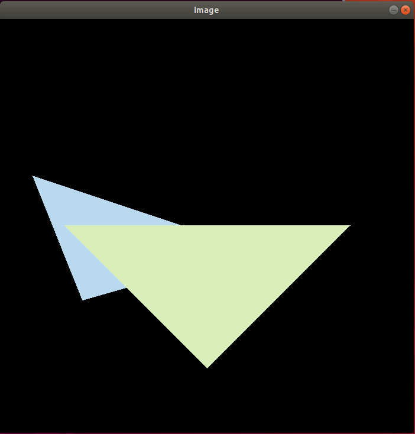
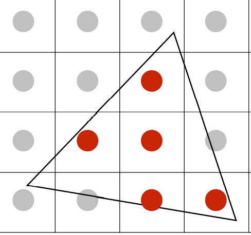
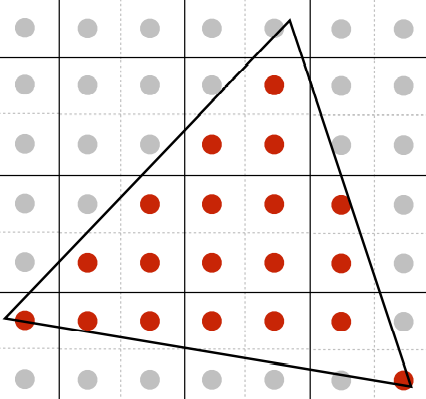
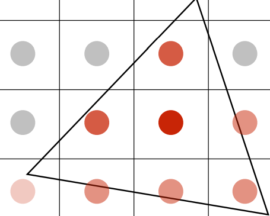
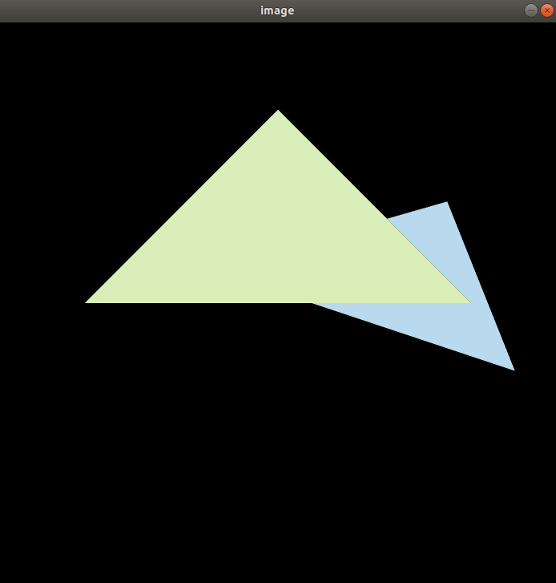
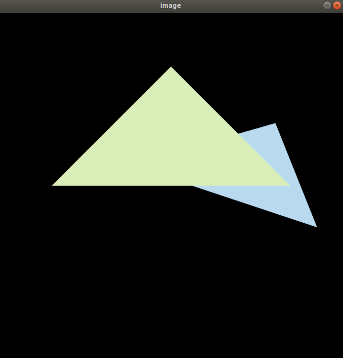

# GAMES101-作业2

任务：

## 1. 检测点是否在三角形内

假设有点P和三角形ABC，那么三角形的三个边按照顺序首尾相连组成三个向量 AB, BC, CA

然后再取三角形边向量的起点，以点P为终点得到一个新向量AP/BP/CP

然后由对应的边向量**叉乘**对应的指向点的向量，即AB x AP, BC x BP, CA x CP，三个叉乘结果的z值，如果同号，则说明该点在三角形内，否则就不在三角形内。

实现代码如下：

```cpp
static bool insideTriangle(int x, int y, const Vector3f *_v)
{
    // TODO: Implement this function to check if the point (x, y) is inside the triangle represented by _v[0], _v[1], _v[2]

    // use the corss product of (vector of triangle edge) and (vector of same starting point of the edge to the point)
    // if the sign of the z-value of three cross products are the same (all positive or all negative),
    // then the point is in the triangle, otherwise is not.
    Vector3f vec_v_to_P = {x - _v[2].x(), y - _v[2].y(), -_v[2].z()};
    Vector3f vec_v_to_v = {_v[0].x() - _v[2].x(), _v[0].y() - _v[2].y(), _v[0].z() - _v[2].z()};
    auto cross_z = vec_v_to_v.cross(vec_v_to_P).z();
    for (int i = 0; i < 2; ++i)
    {
        vec_v_to_P = {x - _v[i].x(), y - _v[i].y(), -_v[i].z()};
        vec_v_to_v = {_v[i + 1].x() - _v[i].x(), _v[i + 1].y() - _v[i].y(), _v[i + 1].z() - _v[i].z()};
        if (cross_z * vec_v_to_v.cross(vec_v_to_P).z() < 0)
        {
            return false;
        }
    }
    return true;
}
```


## 2. 获得三角形的包围盒

根据函数形参Triangle &t，查看Triangle类的定义可知，三角形的三个点存在Vector3f v[3]这个有3个元素的一维数组中。框架的第一句通过调用Triangle类的toVector4()函数，使每个点从xyz坐标多增了一个维度变成xyzw齐次坐标，但实际并不影响。

查看toVector4()函数的实现细节可以知道auto v中v是Vector4f的3个元素的一维数组。获取三角形的AABB盒，很显然只需比较三个点的坐标，取最大的x、最大的y、最小的x、最小的y即可得到包围盒。

这部分的实现代码如下：

```cpp
int xmax = INT_MIN, ymax = INT_MIN;
int xmin = INT_MAX, ymin = INT_MAX;
for (const auto &cord : v)
{
    xmax = std::max(xmax, static_cast<int>(std::ceil(cord.x())));
    ymax = std::max(ymax, static_cast<int>(std::ceil(cord.y())));
    xmin = std::min(xmin, static_cast<int>(std::floor(cord.x())));
    ymin = std::min(ymin, static_cast<int>(std::floor(cord.y())));
}
```


## 3. 检查点是否在三角形内，若在则更新深度值和像素颜色设定

得到包围盒后，就要遍历包围盒中的每个像素点，检查这个像素点是否在三角形内，是的话就检查三角形的深度值与Z-buffer（变量名是depth_buffer）中的深度值做比较，深度值小表示离相机更近，如果离相机更近，就更新depth_buffer中对应位置的深度值和该像素点的颜色。

由于只知道三角形三个点的深度，三角形内部点的深度是通过插值来完成的（这部分课程没讲，代码直接给了直接用就行）。

查看depth_buffer定义可知其是个一维的vector容器，那么就需要用到get_index函数，来将坐标转换成depth_buffer中对应的index索引，然后再用于判断、更新深度值。

更新像素用set_pixel()函数，查看其定义可知形参第一位为Vector3f的坐标，创建一个临时变量即可；形参第二位是要设定的颜色，Triangle类里面有getColor()函数可以获取到该三角形的颜色来作为第二个形参。

这部分的实现代码如下：

```cpp
for (int x = xmin; x <= xmax; ++x)
{
    for (int y = ymin; y <= ymax; ++y)
    {
        if (insideTriangle(x, y, t.v))
        {
            // If so, use the following code to get the interpolated z value.
            auto [alpha, beta, gamma] = computeBarycentric2D(x, y, t.v);
            float w_reciprocal = 1.0 / (alpha / v[0].w() + beta / v[1].w() + gamma / v[2].w());
            float z_interpolated = alpha * v[0].z() / v[0].w() + beta * v[1].z() / v[1].w() + gamma * v[2].z() / v[2].w();
            z_interpolated *= w_reciprocal;

            auto depth_buf_index = get_index(x, y);
            if (z_interpolated < depth_buf[depth_buf_index])
            {
                depth_buf[depth_buf_index] = z_interpolated;

                // TODO: set the current pixel (use the set_pixel function) to the color of the triangle (use getColor function) if it should be painted.
                set_pixel(Vector3f(x, y, 0), t.getColor());
            }
        }
    }
}
```


## 完成基础部分后得到的结果图



可以看到蓝色三角形边上有明显的锯齿。


## 4. 提高项：用super-sampling处理Anti-aliasing

参考：https://blog.csdn.net/qq_36242312/article/details/105758619

原理：用MSAA 4X(Multisampling Anti-aliasing) 多重采样反走样

根据Lecture_05的课件大致知道，用多重采样来反走样的本质就是做卷积，将一个像素分成4个子像素后，判断有多少个子像素在三角形内，然后根据子像素在三角形内的数量在设定该像素的颜色的深浅，如下图所示（图来自Lecture_05的Page 63~67）：







代码部分：

首先我们要对原来的insideTriangle的形参类型做修改，原本的坐标x,y都是int型，为了判断子像素是否在其中，需要将形参类型改为float或double，否则其他代码正确也无法得到正确的效果，因为没有成功取到子像素。

同时为了方便，将插值部分放到一个lambda表达式中后用function容器来封装成一个可调用对象depth_interpolate。

**MSAA 4X 深度**：把一个点看成一个格子，判断里面4个小点是否落在三角形内，然后找到其中插值的最小z值，和帧缓冲中的z值进行比较替换即可。
**MSAA 4X 颜色**：判断有4个小点中有几个小点落入三角形，然后按比例对颜色进行采样即可。

```cpp
int count = 0; // tear apart 1 pixel into 4 subpixels and record how many subpixels are in the triangle
float min_depth = std::numeric_limits<float>::infinity();
for (int i = 0; i < 4; ++i)
{
    float tmpx = x + pos[i][0], tmpy = y + pos[i][1];
    if (insideTriangle(tmpx, tmpy, t.v))
    {
        float z_interpolated = depth_interpolate(tmpx, tmpy, t);
        min_depth = std::min(min_depth, z_interpolated);
        ++count;
    }
}
if (count != 0)
{
    int depth_buf_index = get_index(x, y);
    if (min_depth < depth_buf[depth_buf_index])
    {
        // update the Z-buffer
        depth_buf[depth_buf_index] = min_depth;
        // convolute/average the color
        set_pixel(Vector3f(x, y, 1.f), t.getColor() * count / 4);
    }
}
```


## 用MSAA采样后的结果图（有黑边）



相比于前面的结果图，可以很明显看到蓝色三角形上面的边和下面的边的锯齿消失了（或者说锯齿变得模糊了）。但根据作业pdf可知，三角形之间有黑边其实是不正确的结果，原因是在对三角形边缘采样时，实际上采样的是三角形颜色+背景色，背景为黑色，所以有黑边。


## 修正黑边

定义4倍大小的frame_buf即super_frame_buf，以及4倍大小的depth_buf即super_depth_buf，并在rasterizer::clear和rasterizer::rasterizer这2个函数中添加对2个新buf的处理。

核心逻辑如下：

```cpp
int count = 0; // tear apart 1 pixel into 4 subpixels and record how many subpixels are in the triangle
int eid = get_index(x, y) * 4;
for (int i = 0; i < 4; ++i)
{
    float tmpx = x + pos[i][0], tmpy = y + pos[i][1];
    if (insideTriangle(tmpx, tmpy, t.v))
    {
        float z_interpolated = depth_interpolate(tmpx, tmpy, t);
        if (z_interpolated < super_depth_buf[eid + i])
        {
            super_depth_buf[eid + i] = z_interpolated;
            super_frame_buf[eid + i] = t.getColor();
            ++count; // record how many subpixels pass the depth test
        }
    }
}
if (count != 0)
{
    int depth_buf_index = get_index(x, y);
    Vector3f point{(float)x, (float)y, 0.0f};
    Vector3f color{(super_frame_buf[eid] + super_frame_buf[eid + 1] + super_frame_buf[eid + 2] + super_frame_buf[eid + 3]) / 4};
    // convolute/average the color
    set_pixel(point, color);
}
```


## 用MSAA采样后的结果图（无黑边）




## Cost of MSAA

在虚拟机设置MSAA=true运用MASS 4X的效果反走样时，能明显看到终端的frame count更新比不用MSAA要慢很多，这是因为MSAA的计算量是原始采样的4倍，非常耗时间。


## bug fix：

作业2代码得到的三角形和pdf里面的三角形是中心对称的（180°）选择，具体原因是：

1.opencv左上为原点，课程中左下为原点，所以导致y，z两轴是反着的。
2.代码中zNear和zFar是按照Z轴正方向给的。

所以，在计算top的时候，将原本的计算方式改为

```cpp
top = -zNear * tanf(fov_radian / 2);
```

即可使显示正常。

参考链接：[作业2出现上下左右颠倒的问题成因是什么以及应当如何解决 – 计算机图形学与混合现实在线平台 (games-cn.org)](http://games-cn.org/forums/topic/zuoye2chuxianshangxiazuoyoudiandaodewentichengyinshishenmeyijiyingdangruhejiejue/)

[GAMES101作业2及课程总结（重点解决黑边问题）_我是小菜狗的博客-CSDN博客_games101作业2](https://blog.csdn.net/Xuuuuuuuuuuu/article/details/124172397)

