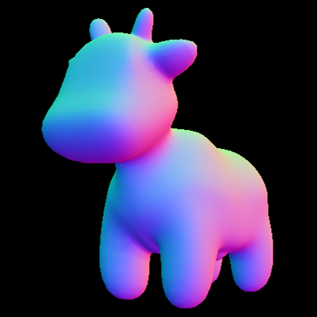
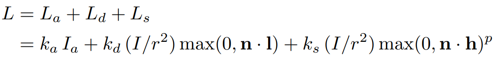
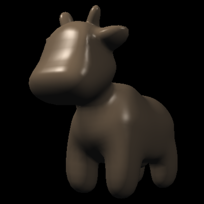
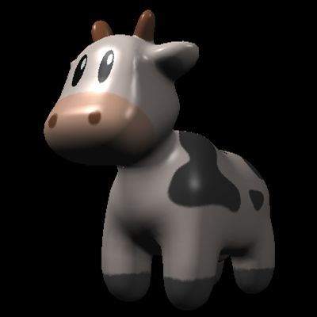
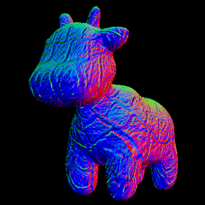
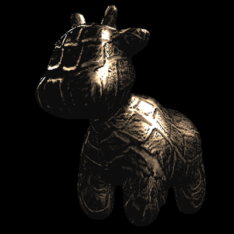
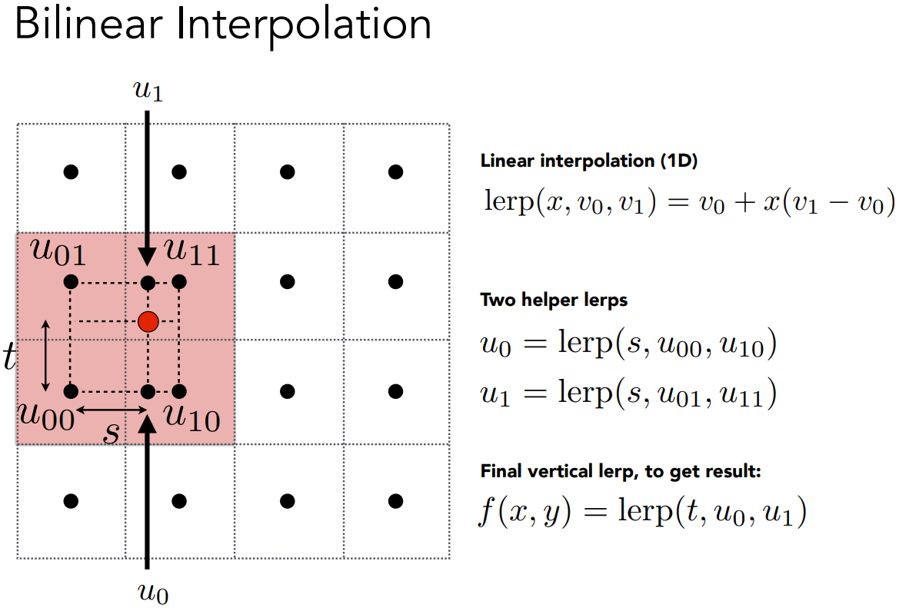

# GAMES101-作业3


## 任务一：修改函数 rasterize_triangle(const Triangle& t) in rasterizer.cpp: 在此 处实现与作业 2 类似的插值算法，实现法向量、颜色、纹理颜色的插值。

与作业二类似，只是在经过insideTriangle函数判断后，除了计算深度插值外，还要计算颜色、法向量、纹理颜色的插值。

在rasterizer.cpp中，已经帮我们实现好了2个interpolate函数，一个接受Vector3f的参数，一个接受Vector2f的参数。

参数说明：

interpolated_color：根据三角形三个顶点的颜色，插值求三角形内部某个点（坐标为重心坐标）的颜色。

interpolated_normal：根据三角形三个顶点的法向量，插值求内部某个点的法向量

interpolated_texcoords：根据三角形三个顶点纹理对应的纹理坐标，插值求内部某个点的纹理对应的纹理坐标(u,v)

interpolated_shadingcoords：插值求着色点的坐标

```cpp
if (insideTriangle(x, y, t.v))
{
    auto [alpha0, beta0, gamma0] = computeBarycentric2D(x, y, t.v);
    float Z = 1.0 / (alpha0 / v[0].w() + beta0 / v[1].w() + gamma0 / v[2].w());
    float zp = alpha0 * v[0].z() / v[0].w() + beta0 * v[1].z() / v[1].w() + gamma0 * v[2].z() / v[2].w();
    zp *= Z;

    int depth_buf_index = get_index(x, y);
    if (zp < depth_buf[depth_buf_index])
    {
        depth_buf[depth_buf_index] = zp;

        // TODO: Interpolate the attributes:
        auto interpolated_color = interpolate(alpha0, beta0, gamma0, t.color[0], t.color[1], t.color[2], 1.f);
        auto interpolated_normal = interpolate(alpha0, beta0, gamma0, t.normal[0], t.normal[1], t.normal[2], 1.f).normalized();
        auto interpolated_texcoords = interpolate(alpha0, beta0, gamma0, t.tex_coords[0], t.tex_coords[1], t.tex_coords[2], 1.f);
        auto interpolated_shadingcoords = interpolate(alpha0, beta0, gamma0, view_pos[0], view_pos[1], view_pos[2], 1.f);
        fragment_shader_payload payload(interpolated_color, interpolated_normal.normalized(), interpolated_texcoords, texture ? &*texture : nullptr);
        payload.view_pos = interpolated_shadingcoords;
        auto pixel_color = fragment_shader(payload);
        set_pixel(Eigen::Vector2i(x, y), pixel_color);
    }
}
```


## 任务二：修改函数 get_projection_matrix() in main.cpp: 将你自己在之前的实验中 实现的投影矩阵填到此处，此时你可以运行 ./Rasterizer output.png normal 来观察法向量实现结果。

bug fixed：修复输出的图片为pdf参考图的中心对称图，修复方式见作业2的README.md文件。

法线贴图结果如下：




## 任务三：修改函数 phong_fragment_shader() in main.cpp: 实现 Blinn-Phong 模型计 算 Fragment Color.



根据上述布林冯反射模型的公式来计算结果，将结果存储在result_color中。

其中k~d~项用插值得到的颜色来代替。

由于环境光只有一个，所以result_color只用加一次环境光，应当放在循环外面。

cwiseProduct方法是向量的每个项对应相乘后得到的向量，即x=x1\*x2,y=y1\*y2,z=z1\*z2。

视线向量view_dir可通过eye_pos-point求得（point是着色点的坐标）

对于每个光线，光线方向向量light_dir可通过light.position（光源位置）-point（着色点位置）求得。

light_dir的模即上述公式中的光源到着色点的距离r，所以到达着色点的光强=light.intensity/light_dir.dot(light_dir)，点乘即得到r^2^。

之后按照公式进行计算即可。需要注意的是公式中的向量点乘的目的其实是为了得到两个向量夹角的cos值，写成点乘是因为公式中的向量都是单位向量，单位向量与单位向量点乘的结果就是2个单位向量夹角的余弦值，所以在点乘的对象应当是 各个向量规范化后得到的单位向量。

```cpp
Eigen::Vector3f view_dir = eye_pos - point;

result_color += ka.cwiseProduct(amb_light_intensity);

for (auto &light : lights)
{
    // TODO: For each light source in the code, calculate what the *ambient*, *diffuse*, and *specular*
    // components are. Then, accumulate that result on the *result_color* object.

    Eigen::Vector3f light_dir = light.position - point;
    Eigen::Vector3f light_intensity_arrived = light.intensity / light_dir.dot(light_dir);

    result_color += kd.cwiseProduct(light_intensity_arrived) * std::max(0.f, normal.normalized().dot(light_dir.normalized()));
    result_color += ks.cwiseProduct(light_intensity_arrived) * pow(std::max(0.f, normal.normalized().dot((light_dir + view_dir).normalized())), p);
}

return result_color * 255.f;
```

裸布林冯着色结果如下：




## 任务四：修改函数 texture_fragment_shader() in main.cpp: 在实现 Blinn-Phong 的基础上，将纹理颜色视为公式中的 kd，实现 Texture Shading Fragment Shader.

根据函数前面最开始的代码可知，k~d~使用texture_color来替代的，而texture_color又是通过return_color初始化的，因此在if判断里面，我们就要通过纹理坐标得到纹理颜色，将其存储在return_color中。

```cpp
if (payload.texture)
{
    // TODO: Get the texture value at the texture coordinates of the current fragment
    return_color = payload.texture->getColor(payload.tex_coords[0], payload.tex_coords[1]);
}
```

后续的对光处理的部分直接复制粘贴phong_shader里面的对光处理部分即可。

纹理贴图结果如下：




## 任务五：修改函数 bump_fragment_shader() in main.cpp: 在实现 Blinn-Phong 的 基础上，仔细阅读该函数中的注释，实现 Bump mapping.

凹凸贴图中，根据注释来完成代码。注释的代码中的w为纹理类中的width，除数h为纹理类中的height。

重点是dU和dV的计算方式中，是用差分的方法来求切线，而纹理查询得到的法线是个向量，因此要取其的模再来计算。

TBN矩阵是将切线空间转换到世界空间。

```cpp
result_color = normal;
Texture *pTex = payload.texture;

float x = normal[0], y = normal[1], z = normal[2];
float u = payload.tex_coords[0], v = payload.tex_coords[1];
float w = pTex->width, h = pTex->height;

Eigen::Vector3f t(x * y / sqrt(x * x + z * z), sqrt(x * x + z * z), z * y / sqrt(x * x + z * z));
Eigen::Vector3f b = normal.cross(t);
Eigen::Matrix3f TBN;
TBN << t[0], b[0], normal[0],
t[1], b[1], normal[1],
t[2], b[2], normal[2];
float dU = kh * kn * (pTex->getColor(u + 1.f / w, v).norm() - pTex->getColor(u, v).norm());
float dV = kh * kn * (pTex->getColor(u, v + 1.f / h).norm() - pTex->getColor(u, v).norm());
Vector3f ln(-dU, -dV, 1);
result_color = (TBN * ln).normalized();
```

凹凸贴图结果如下：




## 任务六：修改函数 displacement_fragment_shader() in main.cpp: 在实现 Bump mapping 的基础上，实现 displacement mapping.

位移贴图相比于凹凸贴图，是实际改变了着色点的位置，注释代码中的Position p即point变量。

相比于凹凸贴图的代码，在normal变量得到最终值前，对point赋值：

```cpp
point += kn * normal * pTex->getColor(u, v).norm();
```

这句话的意思是将位移贴图中法线产生的扰动增加到着色点上。

后续的光线处理的代码和phong_shader一样，用布林冯着色模型。

位移贴图结果如下：




## 提高项：双线性纹理插值: 使用双线性插值进行纹理采样, 在 Texture 类中实现一个新方法 Vector3f getColorBilinear(float u, float v) 并 通过 fragment shader 调用它。为了使双线性插值的效果更加明显，你应该 考虑选择更小的纹理图。请同时提交纹理插值与双线性纹理插值的结果，并 进行比较。

双线性插值原理如下：



这里还需要注意opencv坐标的高和uv坐标和高**是相反的**，即opencv图像坐标的y坐标是逐渐增大，而对应的uv坐标下的v坐标是逐渐减小，所以计算中心点的邻域点时，也要注意v_min实际上是在图像中中心点的上面，而v_max是在图像中中心点的下面（参考链接：https://blog.csdn.net/qq_36242312/article/details/105888669）

```cpp
Eigen::Vector3f getColorBilinear(float u, float v)
{
    auto u_img = u * width;
    auto v_img = (1 - v) * height;

    float u_min = std::floor(u_img);
    float u_max = std::min(static_cast<float>(width), std::ceil(u_img));
    float v_min = std::floor(v_img);
    float v_max = std::min(static_cast<float>(height), std::ceil(v_img));

    cv::Vec3b u00 = image_data.at<cv::Vec3b>(v_max, u_min);
    cv::Vec3b u10 = image_data.at<cv::Vec3b>(v_max, u_max);
    cv::Vec3b u01 = image_data.at<cv::Vec3b>(v_min, u_min);
    cv::Vec3b u11 = image_data.at<cv::Vec3b>(v_min, u_max);
    std::function<cv::Vec3b(float, cv::Vec3b, cv::Vec3b)> lerp = [](float x, cv::Vec3b v0, cv::Vec3b v1)
    {
        return v0 + x * (v1 - v0);
    };

    float s = u_img - u_min;
    float t = v_img - v_max;
    auto u0 = lerp(s, u00, u10);
    auto u1 = lerp(s, u01, u11);
    auto color = lerp(t, u0, u1);

    return Eigen::Vector3f(color[0], color[1], color[2]);
}
```

