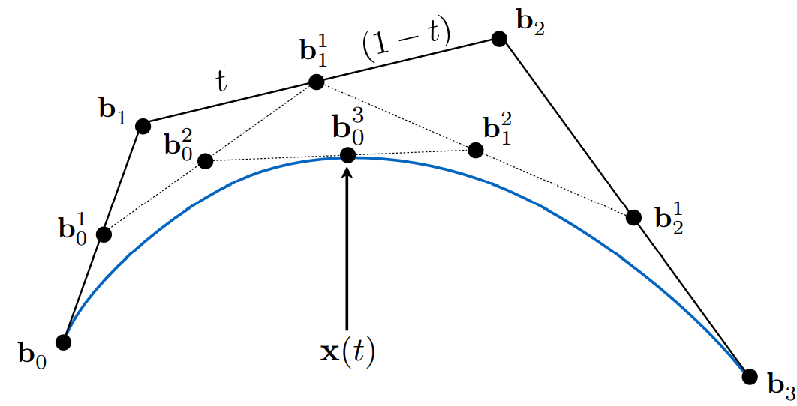
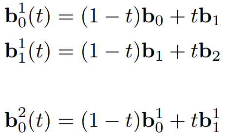
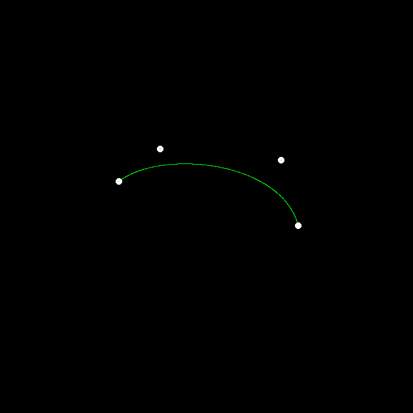
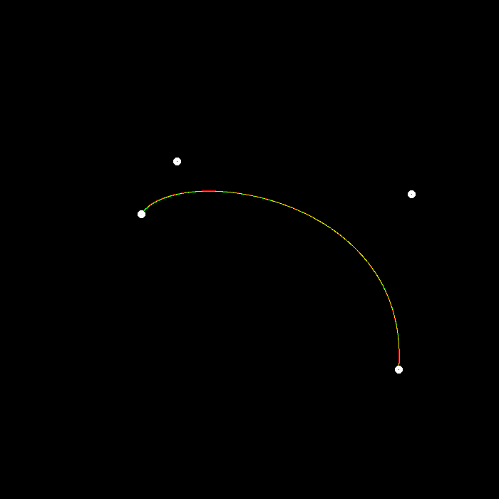
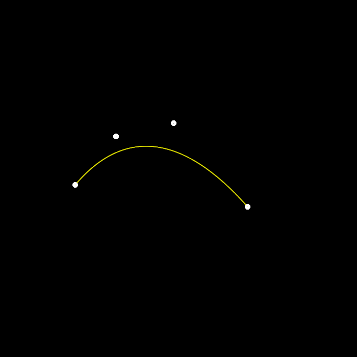

# GAMES101-作业4

## 任务1：使用 de Castlejau算法得到贝塞尔曲线在时刻t时的点



根据课件图片可知，给定\[0,1\]之间的任意时刻t，每次取相邻2点之间的时刻t位置的点，得到新的点，连接这些相邻的新点，再重复上述步骤，直到只剩一个点时无法生成新线段，此时这一个点就是贝塞尔曲线在时刻t时的点。

图片中的b~1~与b~2~之间的点，b~1~^1^与点b1的距离为t，与b2距离为(1-t)，当t越小时，该点越靠近b1而远离b2，即更受到b1的影响，所以相乘的算式中，b1的系数为(1-t)，b2的系数为t。



具体代码如下：

```cpp
cv::Point2f recursive_bezier(const std::vector<cv::Point2f> &control_points, float t)
{
    // TODO: Implement de Casteljau's algorithm
    int sz = control_points.size();
    std::vector<cv::Point2f> iter_points(control_points);

    while (sz > 1)
    {
        for (int i = 0; i < sz - 1; ++i)
        {
            iter_points[i] = (1 - t) * iter_points[i] + t * iter_points[i + 1];
        }
        --sz;
    }

    return cv::Point2f(iter_points[0]);
}
```


## 任务2：t从0开始，逐渐增加t的值，调用de Castlejau算法的函数来计算t时刻的点，并设置该点的颜色为绿色，直到t>1时，贝塞尔曲线计算完成。

```cpp
void bezier(const std::vector<cv::Point2f> &control_points, cv::Mat &window)
{
    // TODO: Iterate through all t = 0 to t = 1 with small steps,
    // and call de Casteljau's recursive Bezier algorithm.

    for (float t = 0.f; t <= 1.f; t += 0.001f)
    {
        window.at<cv::Vec3b>(recursive_bezier(control_points, t))[1] = 255; //BGR
    }
}
```


## 任务1、2的结果

main函数中调用beizer函数的结果：



在main函数中调用naive_beizer函数和beizer函数的结果：




## 提高项：实现对 Bézier 曲线的反走样。(对于一个曲线上的点，不只把它对应于一个像素，你需要根据到像素中心的距离来考虑与它相邻的像素的颜色。)

用作业2中MSAA类似的方法，取曲线上当前浮点数坐标的周围4个像素，然后根据点到像素的距离，来设置像素颜色。

2x2像素点的像素中心之间的最大距离为根号2，设distance为点到像素的距离，则其颜色的权重应当为(sqrt(2)-distance)/sqrt(2)。

具体代码如下：

```cpp
void anti_aliasing(const cv::Point2f &point, cv::Mat &window, int bgr_idx)
{
    float x_min = std::floor(point.x);
    float x_max = std::ceil(point.x);
    float y_min = std::floor(point.y);
    float y_max = std::ceil(point.y);

    std::vector<cv::Point2f> neighbor_points(4);
    neighbor_points[0] = {x_min, y_min};
    neighbor_points[1] = {x_min, y_max};
    neighbor_points[2] = {x_max, y_min};
    neighbor_points[3] = {x_max, y_max};
    for (const auto &n_point : neighbor_points)
    {
        auto p = point - n_point;
        float distance = sqrt(p.dot(p));
        const float sqrt2 = sqrt(2);
        auto tmp = static_cast<uchar>(255.f * (sqrt2 - distance) / sqrt2);
        if (window.at<cv::Vec3b>(n_point)[bgr_idx] < tmp)
        {
            window.at<cv::Vec3b>(n_point)[bgr_idx] = tmp;
        }
    }
}
```

然后在naive_beizer和beizer这2个函数中，将原有的像素颜色赋值语句注释掉，改为调用anti-aliasing函数来设置像素颜色

```cpp
/* naive_beizer函数语句调整 */
// window.at<cv::Vec3b>(point.y, point.x)[2] = 255; //BGR
anti_aliasing(point, window, 2);

/* beizer函数语句调整 */
// window.at<cv::Vec3b>(recursive_bezier(control_points, t))[1] = 255; //BGR
anti_aliasing(recursive_bezier(control_points, t), window, 1);
```


## 反走样结果：



