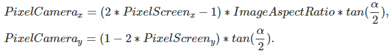
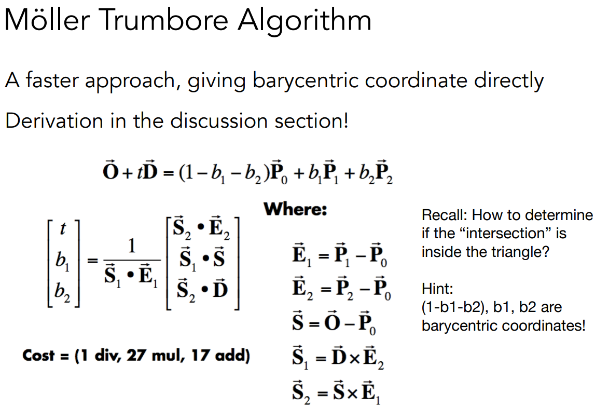
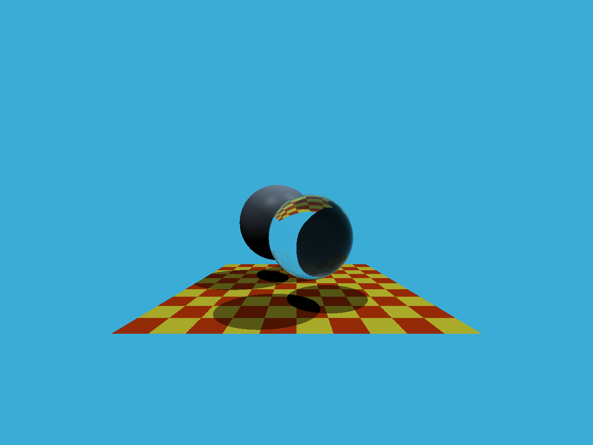

# GAMES101-作业5

## 任务1：Renderer.cpp中的Render()：

参考链接：https://www.scratchapixel.com/lessons/3d-basic-rendering/ray-tracing-generating-camera-rays/generating-camera-rays

当前像素对应image plane上的像素坐标为：



代码中的scale即$tan (\frac{fov}{2})$即$tan(\frac{\alpha}{2})$ 。

具体代码如下：

```cpp
for (int j = 0; j < scene.height; ++j)
{
    for (int i = 0; i < scene.width; ++i)
    {
        // generate primary ray direction
        float x = (2 * (i + 0.5) / (float)scene.width - 1) * scale * imageAspectRatio;
        float y = (1 - 2 * (j + 0.5) / (float)scene.height) * scale;
        // TODO: Find the x and y positions of the current pixel to get the direction
        // vector that passes through it.
        // Also, don't forget to multiply both of them with the variable *scale*, and
        // x (horizontal) variable with the *imageAspectRatio*

        Vector3f dir = normalize(Vector3f(x, y, -1)); // Don't forget to normalize this direction!
        framebuffer[m++] = castRay(eye_pos, dir, scene, 0);
    }
    UpdateProgress(j / (float)scene.height);
}
```


## 任务2：Triangle.hpp中的rayTriangleIntersect()：

根据Lecture 13的Page 29中的Möller Trumbore算法来求得：



具体代码如下：

```cpp
bool rayTriangleIntersect(const Vector3f &v0, const Vector3f &v1, const Vector3f &v2, const Vector3f &orig,
                          const Vector3f &dir, float &tnear, float &u, float &v)
{
    // TODO: Implement this function that tests whether the triangle
    // that's specified at v0, v1 and v2 intersects with the ray (whose
    // origin is *orig* and direction is *dir*)
    // Also don't forget to update tnear, u and v.

    Vector3f e1 = v1 - v0, e2 = v2 - v0;
    Vector3f s = orig - v0, s1 = crossProduct(dir, e2), s2 = crossProduct(s, e1);
    Vector3f tuv(dotProduct(s2, e2), dotProduct(s1, s), dotProduct(s2, dir));
    tuv = tuv / dotProduct(s1, e1);
    tnear = tuv.x;
    u = tuv.y;
    v = tuv.z;

    return tnear > 0 && u > 0 && v > 0 && (1 - u - v) > 0;
}
```

代码中的u, v即图片中的b1, b2。

## Whitted-style raytracing结果：



