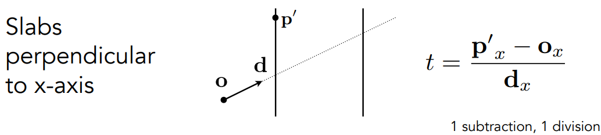
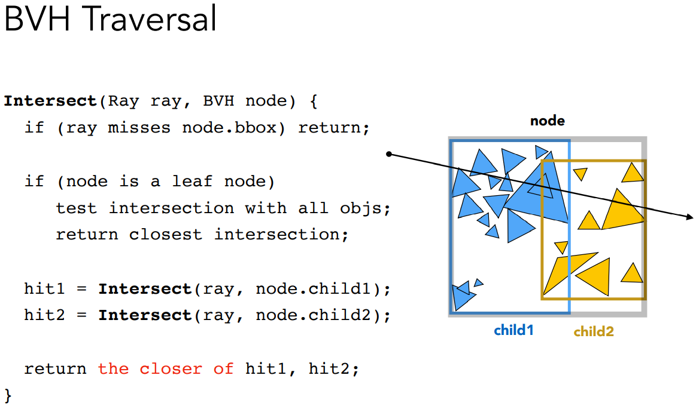
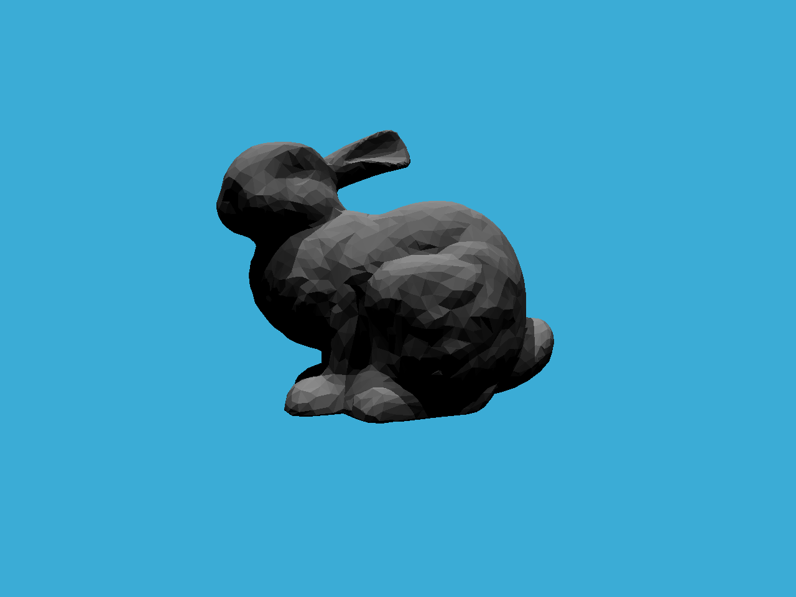

# GAMES101-作业6

## 任务1：将作业5的光线生成过程粘贴到Renderer.cpp中，并按照新框架更新相应的调用格式

只有castRay从Renderer.cpp中定义的函数变成了scene下面的成员函数：

```cpp
framebuffer[m++] = scene.castRay(Ray(eye_pos, dir), 0);
```


## 任务2：将光线-三角形橡胶函数粘贴到Triangle.hpp的Triangle::getIntersection函数中，并按照新框架更新相应相交信息的格式

前一次作业里面写过，这次里面其实已经写好了，略有不同，一开始看错了以为要粘贴到rayTriangleIntersect()函数中，没看到TODO，但是这个代码写得挺好的，用了提前返回等技巧来减少计算量，可参考学习一下：

pvec即ppt中的S~1~，det即最终的分母，tvec即S，qvec即S~2~，u即b1，v即b2（重心坐标）。

```cpp
bool rayTriangleIntersect(const Vector3f &v0, const Vector3f &v1,
                          const Vector3f &v2, const Vector3f &orig,
                          const Vector3f &dir, float &tnear, float &u, float &v)
{
    Vector3f edge1 = v1 - v0;
    Vector3f edge2 = v2 - v0;
    Vector3f pvec = crossProduct(dir, edge2);
    float det = dotProduct(edge1, pvec);
    if (det == 0 || det < 0)
        return false;

    Vector3f tvec = orig - v0;
    u = dotProduct(tvec, pvec);
    if (u < 0 || u > det)
        return false;

    Vector3f qvec = crossProduct(tvec, edge1);
    v = dotProduct(dir, qvec);
    if (v < 0 || u + v > det)
        return false;

    float invDet = 1 / det;

    tnear = dotProduct(edge2, qvec) * invDet;
    u *= invDet;
    v *= invDet;

    return true;
}
```

任务要求的Triangle::getIntersection函数中，要求返回的是inter结构体，可参考Sphere.hpp，coords即相交的坐标，normal即交点的法线，distance即距离光源点的时间，obj指针指向相交的物体即this指针指向的对象，m指针指向相交物体的Material，同样用this->m获取到然后赋值。

```cpp
// TODO: find ray triangle intersection
inter.happened = true;
inter.coords = ray(t_tmp);
inter.normal = normal;
inter.distance = t_tmp;
inter.obj = this;
inter.m = this->m;
return inter;
```


## 任务3：在Bound3.hpp中完成判断包围盒与光线是否相交的函数IntersectP(const Ray& ray, const Vector3f& invDir, const std::array& dirIsNeg) 

根据Lecture 13的page40的公式：



可得到光线与某个面相交时的时间，先根据包围盒的pMin和pMax得到2组时间，然后用Vector3f的静态成员函数Min和Max得到每组平面对应的最小最大时间

然后在循环中根据page 38，**t~enter~=max\{t~min~\}**，**t~exit~=min\{t~max~**\}完成进入和离开包围盒的时间计算。

最后根据page 39的判断条件，**光线与AABB相交当且仅当t~enter~<t~exit~ 且 t~exit~>=0**。

代码如下：

```cpp
inline bool Bounds3::IntersectP(const Ray &ray, const Vector3f &invDir,
                                const std::array<int, 3> &dirIsNeg) const
{
    // invDir: ray direction(x,y,z), invDir=(1.0/x,1.0/y,1.0/z), use this because Multiply is faster that Division
    // dirIsNeg: ray direction(x,y,z), dirIsNeg=[int(x>0),int(y>0),int(z>0)], use this to simplify your logic
    // TODO: test if ray bound intersects

    double t_enter = std::numeric_limits<double>::lowest();
    double t_exit = std::numeric_limits<double>::max();

    const Vector3f t_pmin = (pMin - ray.origin) * invDir;
    const Vector3f t_pmax = (pMax - ray.origin) * invDir;

    const Vector3f t_min = Vector3f::Min(t_pmin, t_pmax);
    const Vector3f t_max = Vector3f::Max(t_pmin, t_pmax);

    for (int i = 0; i < 3; i++)
    {
        t_enter = std::max(t_enter, t_min[i]);
        t_exit = std::min(t_exit, t_max[i]);
    }

    return t_enter < t_exit && t_exit >= 0.0;
}
```

注意：上述代码没有用dirIsNeg这个形参来简化代码，但跑得结果是正确的。

简化版本如下：

```cpp
float t_enter = std::numeric_limits<float>::lowest();
float t_exit = std::numeric_limits<float>::max();

for (int i = 0; i < 3; i++)
{
    float min = (pMin[i] - ray.origin[i]) * invDir[i];
    float max = (pMax[i] - ray.origin[i]) * invDir[i];
    if (!dirIsNeg[i]) // is negative
    {
        std::swap(min, max);
    }
    t_enter = std::max(t_enter, min);
    t_exit = std::min(t_exit, max);
}

return t_enter < t_exit && t_exit >= 0.0;
```


## 任务4：在BVH.cpp中完成加速求交过程的函数getIntersection(BVHBuildNode* node, const Ray ray)

根据Lecture 14的page 37



可得：

```cpp
Intersection BVHAccel::getIntersection(BVHBuildNode *node, const Ray &ray) const
{
    // TODO: Traverse the BVH to find intersection
    Intersection inter;

    if (node == nullptr)
    {
        return inter;
    }

    if (!node->bounds.IntersectP(ray, ray.direction_inv, std::array<int, 3>{ray.direction.x > 0, ray.direction.y > 0, ray.direction.z > 0}))
    {
        return inter;
    }

    if (node->left == nullptr && node->right == nullptr)
    {
        return node->object->getIntersection(ray);
    }

    Intersection hit1 = getIntersection(node->left, ray);
    Intersection hit2 = getIntersection(node->right, ray);

    return hit1.distance < hit2.distance ? hit1 : hit2;
}
```


## BVH运行结果：




## 提高项：实现SAH

参考资料：

1. cmu的ppt，与作业ppt在同一文件夹下。
2. https://blog.csdn.net/qq_36242312/article/details/115495482

