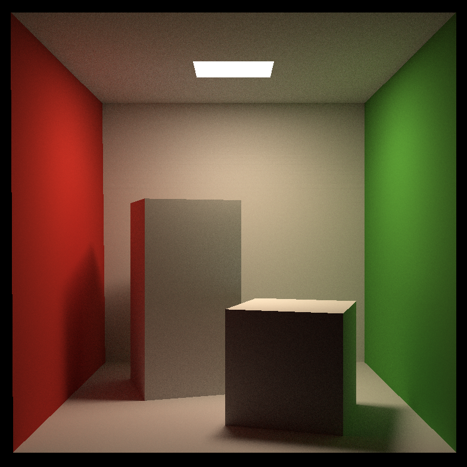

# GAMES101-作业7

必做题的主要思路参考资料：[games101 作业7 path tracing_Coder_Penguin的博客-CSDN博客_games101 作业7](https://blog.csdn.net/weixin_44142774/article/details/116888543)

踩坑全黑及大部分黑，增加OpenMP的多线程支持的参考资料：[GAMES101 作业问题整理 - 知乎 (zhihu.com)](https://zhuanlan.zhihu.com/p/375391720)

spp设置及t_tmp坑的参考资料：[GAMES101 作业7 Path Tracing路线追踪 - 哔哩哔哩 (bilibili.com)](https://www.bilibili.com/read/cv12184818/)

微表面（microfacet）材质的参考资料：

1. [从零开始学图形学：写一个光线追踪渲染器（二）——微表面模型与代码实现 - 知乎 (zhihu.com)](https://zhuanlan.zhihu.com/p/350405670)
2. [GAMES101-现代计算机图形学学习笔记（作业07）_CCCCCCros____的博客-程序员宝宝_games101作业7 - 程序员宝宝 (cxybb.com)](https://www.cxybb.com/article/qq_36242312/116307626)

## 任务：在castRay中实现path tracing算法

代码参考了链接1、3、4

随机数生成器用static，配上OpenMP的并行加速，快了很多，其中材质的eval函数，链接4中传入的方式与伪代码有出入，应该以伪代码为准？且eval函数中实际上只使用了wo，并没有使用wi，所以wi的方向性暂时不影响（链接4以及课件中都认为入射出射光线都是从表面向外）。

最后生成的图片中有极少数的白色噪点，按照[Games101 作业7 绕坑引路 (Windows) – 计算机图形学与混合现实研讨会 (games-cn.org)](http://games-cn.org/forums/topic/games101-zuoye7-raokengyinlu-windows/)的说法，在depth==0返回时，将结果截断在\[0,1\]内，可以解决。

伪代码：

结果图片（spp=256）：

微表面材质的只是复制粘贴了知乎链接的代码，并没有运行过，且Sphere的Intersection函数的判断条件也未更改。
